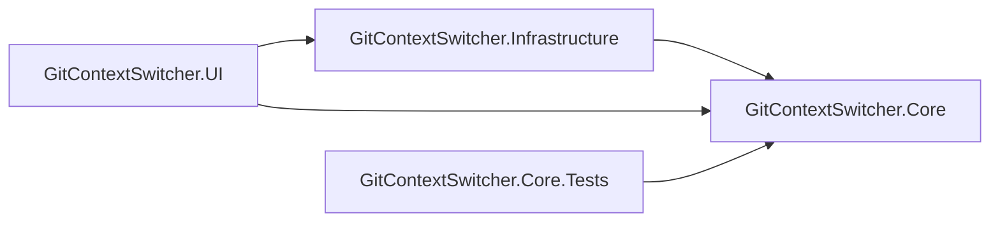

# Code Summary

> Low-token reference for AI/agent sessions. Read this before exploring the codebase with search tools.

## Overview
GitContextSwitcher is a WPF desktop app (.NET 10) for saving and restoring "work contexts" (pending Git changes, branch/HEAD info, stashes) per profile, so a developer can switch between multiple in-flight work streams on the same repo. Git interaction is done via the `git` CLI (no LibGit2Sharp).

## Project Dependency Graph

## Symbol Index

### GitContextSwitcher.Core (models + service contracts)
| Symbol | File | Responsibility |
|---|---|---|
| `WorkProfile` | Models/WorkProfile.cs | A named profile tracking a repo path and its saved contexts/history. |
| `SavedWorkContext` | Models/SavedWorkContext.cs | Metadata for a saved context (id, description, created date, HEAD branch/sha, stash ref, file count). |
| `GitFileChange` | Models/GitFileChange.cs | Represents a single changed file + `GitChangeKind` (Added/Modified/Deleted/Renamed/etc). |
| `ProfileFileEntry` | Models/ProfileFileEntry.cs | File entry metadata persisted with a profile/context. |
| `RepoInfo` | Models/RepoInfo.cs | Snapshot of repo state (branch, sha, dirty status, etc). |
| `AuditEntry` | Models/AuditEntry.cs | History/audit log entry for profile actions. |
| `IGitService` | Services/IGitService.cs | Contract for Git operations (status, export, diff content). |
| `IWorkProfileService` / `InMemoryWorkProfileService` | Services/IWorkProfileService.cs, InMemoryWorkProfileService.cs | Profile CRUD contract + in-memory implementation (used mainly for tests). |
| `IFileSystemService` | Services/IFileSystemService.cs | Filesystem abstraction contract. |

### GitContextSwitcher.Infrastructure (Git CLI + filesystem)
| Symbol | File | Responsibility |
|---|---|---|
| `GitCliService` | Services/GitCliService.cs | `IGitService` implementation that shells out to `git` CLI. |
| `GitExportHelper` | Services/GitExportHelper.cs | Static helpers: run git commands, get changed files (porcelain z), export files, create unified patches, read file content at a commit. |
| `FileSystemService` | Services/FileSystemService.cs | `IFileSystemService` implementation over `System.IO`. |

### GitContextSwitcher.UI (WPF app: views, viewmodels, services)
| Symbol | File | Responsibility |
|---|---|---|
| `MainViewModel` | ViewModels/MainViewModel.cs | App root VM: profile list, selection, startup load orchestration. |
| `ProfileTabViewModel` | ViewModels/ProfileTabViewModel.cs | Per-profile tab VM: repo info, pending changes tree, save/delete context, history log. |
| `PreviewViewModel` | ViewModels/PreviewViewModel.cs | Saved-context preview/diff VM: loads file tree + diff content for a `SavedWorkContext`. |
| `BaseViewModel` | ViewModels/BaseViewModel.cs | `INotifyPropertyChanged` base + `SetProperty` helper. |
| `GitChangeKindDisplay` | ViewModels/GitChangeKindDisplay.cs | Shared static helper for `GitChangeKind` display (icon glyph, icon brush, suffix text), used by both `PreviewViewModel.FileTreeNode` and `ProfileTabViewModel.FileTreeNode` to avoid duplicated switch expressions. |
| `RelayCommand` | ViewModels/RelayCommand.cs | `ICommand` implementation for MVVM bindings. |
| `ProfileStorageManager` | Services/ProfileStorageManager.cs | Reads/writes profile + saved-context files on disk (per-profile folder layout). |
| `AppPaths` | Services/AppPaths.cs | Resolves `%LocalAppData%\GitContextSwitcher\...` paths per profile. |
| `IProfileStore` / `ProfileFileStore` | Services/IProfileStore.cs, ProfileFileStore.cs | Profile persistence contract + file-based implementation (locking/atomic writes). |
| `ProfileSaveResultEventArgs` | Services/ProfileSaveResultEventArgs.cs | Event args for save-result notifications. |
| `MainWindow` | MainWindow.xaml(.cs) | App shell hosting profile tabs. |
| `ProfileTabControl` | Views/ProfileTabControl.xaml(.cs) | Tab UI: saved-contexts grid, pending-changes tree, diff buttons. |
| `PreviewWindow` / `PreviewPane` | Views/PreviewWindow.xaml(.cs), PreviewPane.xaml(.cs) | Saved-context preview dialog + side-by-side diff viewer (DiffPlex-based), with loading overlay and strict sequence guarding for async diff application. |
| `DiffWindow` | Views/DiffWindow.xaml(.cs) | Standalone diff popup for pending-changes tree double-click. |
| `RepositoryPicker` | Views/RepositoryPicker.xaml(.cs) | Repo folder picker dialog. |
| `SaveContextDialog` | Views/SaveContextDialog.xaml(.cs) | Dialog to name/describe a new saved context. |
| `RepoInfoControl` | Views/RepoInfoControl.xaml(.cs) | Displays current repo branch/sha/status summary. |

## Key Flows
- **App startup**: `App.xaml.cs` -> `MainViewModel` (async quick-load) -> `MainWindow` binds `Profiles`/`SelectedProfile` -> each tab creates a `ProfileTabViewModel`.
- **Save context**: `ProfileTabControl` save action -> `ProfileTabViewModel` -> `GitExportHelper` (export changed files/patch) -> `ProfileStorageManager` (persist under `SavedContexts/<contextId>`).
- **Preview saved context**: `PreviewContextButton` click (`ProfileTabControl.xaml.cs`) -> `new PreviewViewModel(...)` -> `LoadAsync()` (reads `context.json`, builds `Files`/`FileTree` on UI thread) -> `PreviewWindow`/`PreviewPane` builds side-by-side diff (local repo path = left, saved context content = right) with a warning banner that left side may contain local changes.
- **Pending changes diff**: `ProfileTabControl` pending tree double-click or "View Diff" button -> `DiffWindow` (side-by-side DiffPlex view) for the selected leaf file; buttons enabled only when a file (non-directory) leaf node is selected.
- **Profile persistence**: `ProfileFileStore`/`ProfileStorageManager` write under `%LocalAppData%\GitContextSwitcher\profiles\<profileGuid>\` with locking/atomic writes to avoid concurrent-access exceptions.

## Notes for Agents
- WPF `ObservableCollection`s bound to UI (e.g. `PreviewViewModel.Files`, `FileTree`, `FileTreeNode.Children`) must only be mutated on the Dispatcher thread — avoid `ConfigureAwait(false)` before such mutations, or explicitly marshal via `Dispatcher.InvokeAsync`.
- Git operations shell out to the `git` CLI via `GitExportHelper`/`GitCliService` — there is no LibGit2Sharp dependency.
